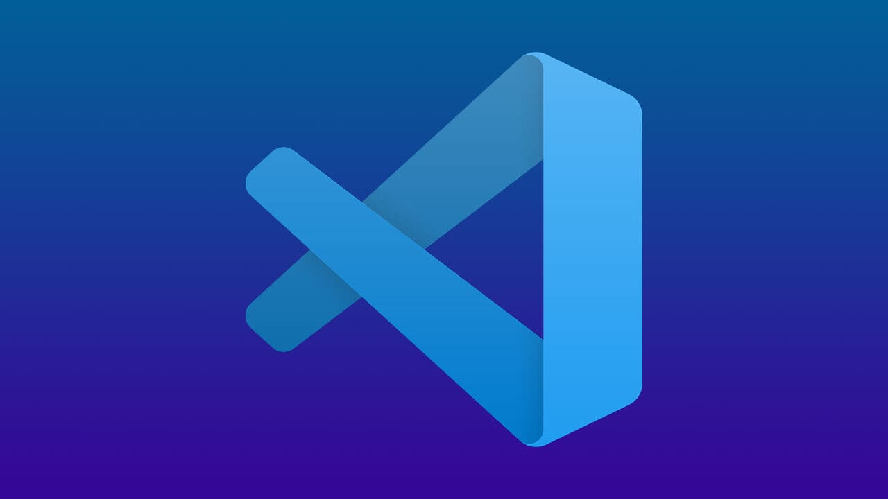

# sproj-prerequisite-html
MIDAS API Seed Project HTML

MIDAS API의 Plugin 개발을 위한 Seed Proejct 환경 구성 안내 입니다.

<b>Note</b>: 아래 내용은 지속적으로 추가될 수 있습니다.

# Getting Started HTML
HTML 예제를 실행하기 위해서는 아래의 절차에 따라 Setting 해주시면 됩니다.

## :hammer: 01. Tools Download and Installing
Seed Project의 기본적인 Tool은 다음과 같습니다.
- VSCode (IDE) -`메모장, Notepad 등을 사용하셔도 무방 합니다.`
- Chrome (Browser) - `Edge, Firefox 등을 사용하셔도 무방 합니다.`

다른 Tool을 사용하여도 무방하지만 모든 Description은 위 Tool에 기반 합니다.
  
### <a href="https://code.visualstudio.com/">VSCode Download</a> and Install

VSCode를 다운로드 하고 설치 합니다.

### <a href="https://www.google.co.kr/intl/ko/chrome/">Chrome Download</a> and Install

Chrome 브라우져를 다운로드 하고 설치 합니다.

## :gun: 02. Client 준비
MIDAS API와 연결 가능한 Client를 준비 합니다.
Gen의 경우, API가 사용가능한 최신 버젼 릴리즈를 준비 합니다.

### reference
- <a href="https://midasitdev.atlassian.net/wiki/spaces/AD/pages/2874999417/Gen+Release+Packing">Gen Relealse Packing 방법</a>

기본적인 환경 준비가 완료 되었습니다.

Enjoy Seed Project!
