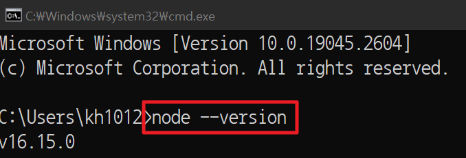

# :zap: Getting Started with React

This is a basic plugin project using MIDAS API.
To run the project, you need to satisfy prerequisites.

### 01. Satisfy the basic plugin development environment

React can start in the same environment as html.\
Please refer to this document [Getting Started With HTML](/html/README.md) and prepare the basic development environment.

### 02. Base Framework download and install `NodeJS install`

Additionally, using react, you need to install NodeJS because of an environment to execute javascript.\
Install NodeJS refer to below links.\

- [NodeJS](https://nodejs.org/ko/)
- [Document](https://nodejs.org/ko/docs/)  

When everything is done, input cmd with Window Key + R, and open the cmd window.\
Check if the installation succeeded by inputting "node --version".\
In case of installed abnormally, restart your computer or set up the node environment variable.

